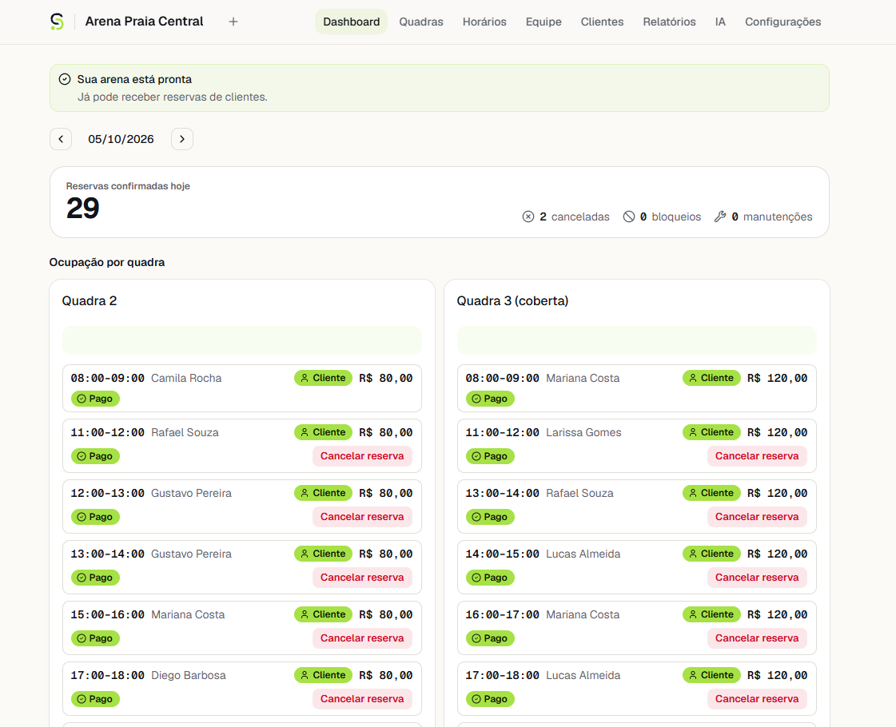
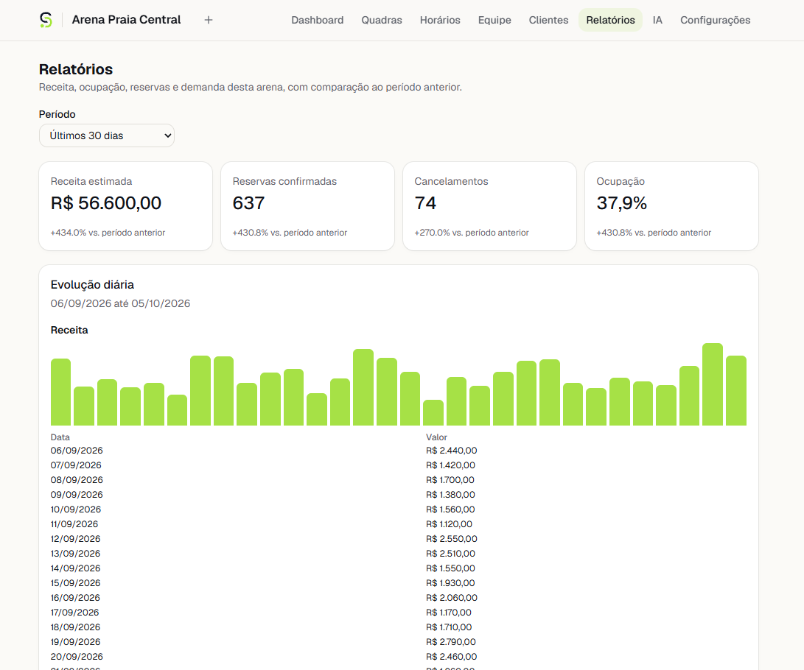
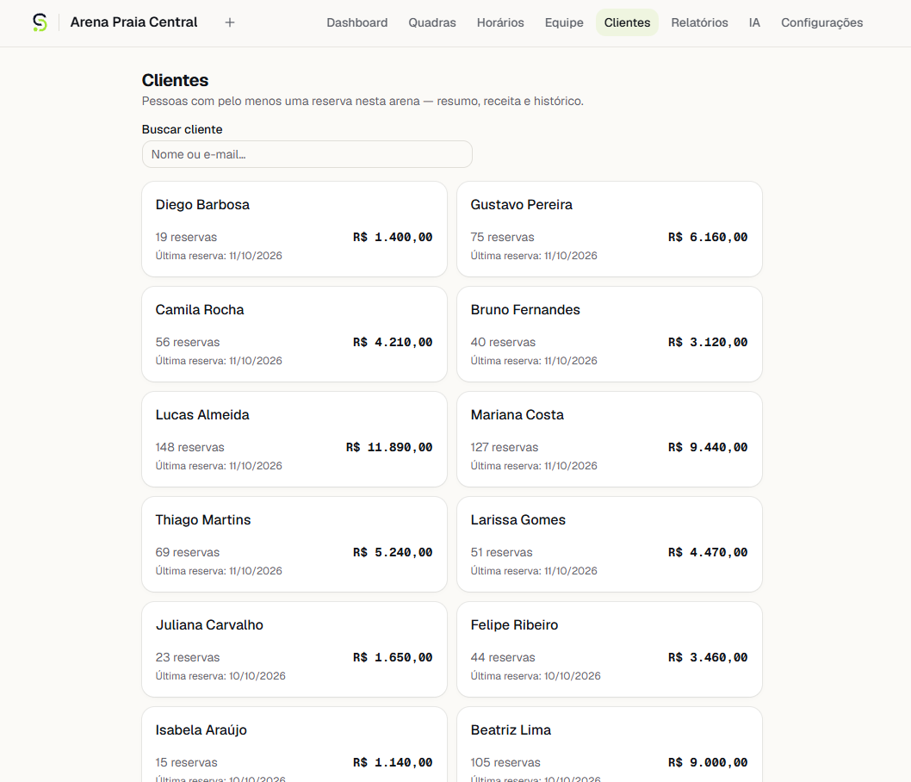
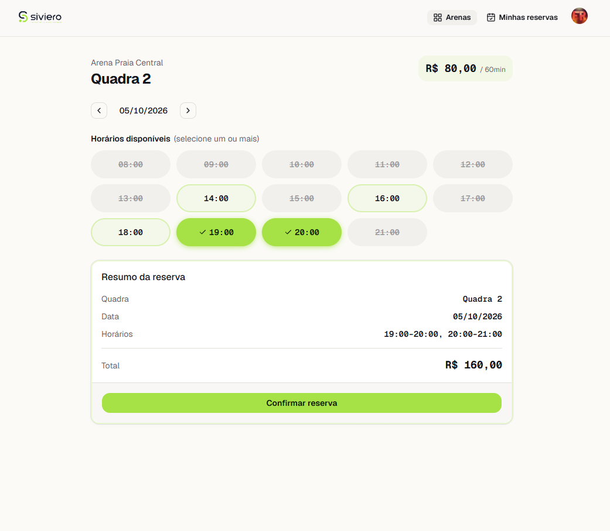
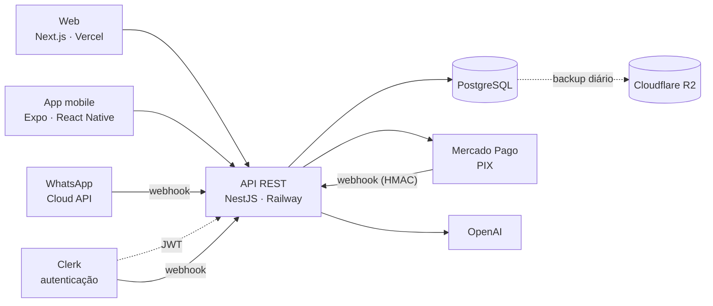

# ArenaHub

[](https://github.com/fraagelo/arenahub/actions/workflows/ci.yml)


**Plataforma SaaS de gestão e reservas para arenas esportivas** (beach tennis, vôlei de praia,
futevôlei, society e outras modalidades). O cliente encontra a arena, vê a disponibilidade real e
reserva pela web, pelo app ou pelo WhatsApp, pagando via PIX. O dono da arena administra quadras,
horários, equipe, clientes e relatórios em um painel próprio, com um assistente de IA que responde
perguntas sobre a operação.

**Em produção:** [app.sivierotech.com.br](https://app.sivierotech.com.br) · API em
`api.sivierotech.com.br`

---

## Telas

| Painel do dia                                       | Relatórios                                    |
| --------------------------------------------------- | --------------------------------------------- |
|        |  |
| **Clientes da arena**                               | **Reserva (visão do cliente)**                |
|  |       |

<sub>Dados de demonstração: clientes e reservas fictícios.</sub>

## Funcionalidades

**Para o cliente**

- Descoberta de arenas e quadras, com disponibilidade calculada no fuso horário da arena
- Reserva com confirmação, histórico e cancelamento ("minhas reservas")
- Pagamento via **PIX** (Mercado Pago), com QR Code e copia-e-cola
- Reembolso automático ao cancelar uma reserva já paga
- **App mobile** (Expo / React Native) com notificações push
- **Reserva pelo WhatsApp** em linguagem natural, com confirmação explícita antes de qualquer ação

**Para o dono da arena**

- Painel administrativo: resumo do dia, ocupação por quadra, próximas reservas
- Gestão de quadras, preços, horários de funcionamento e fuso horário
- Gestão de equipe com papéis (OWNER/ADMIN), convites por e-mail e transferência de propriedade
- Base de clientes com histórico e receita por cliente, isolada por arena
- Relatórios de receita, ocupação e demanda por horário, comparando com o período anterior
- **Assistente de IA** que responde perguntas como "qual quadra está mais ocupada?" usando apenas
  métricas reais calculadas pelo backend

## Destaques técnicos

Os problemas mais interessantes do projeto, e como foram resolvidos:

### Zero double booking, mesmo sob concorrência

Duas pessoas tentando reservar o mesmo horário ao mesmo tempo não podem ambas conseguir. A proteção
fica no PostgreSQL, em três camadas: um `pg_advisory_xact_lock` por quadra, uma pré-checagem que usa
a mesma função SQL da constraint, e uma `EXCLUDE USING GIST` sobre o intervalo ocupado (incluindo o
intervalo de limpeza entre reservas) como autoridade final. Isso é provado por testes de concorrência
reais (`Promise.all` contra o servidor e um Postgres de verdade, sem mock): o mesmo horário disputado
resulta em exatamente uma reserva criada.

### Idempotência de ponta a ponta

Toda criação de reserva e de pagamento aceita uma `Idempotency-Key`, persistida no banco com a
estratégia _claim-first_ (a chave é reservada **antes** de executar a operação). A estratégia
inicial, _claim-last_, foi descartada depois que o teste de concorrência revelou que ela respondia
`409` a um retry legítimo em vez de devolver o resultado original.

### Pagamentos com uma máquina de estados segura

- `Booking` (ocupação da quadra) e `Payment` (ciclo financeiro) são entidades separadas
- O valor cobrado sempre vem do backend, nunca do cliente
- Webhooks do gateway são verificados por HMAC-SHA256 com `timingSafeEqual`, deduplicados e **nunca
  confiam no corpo da notificação**: o status real é sempre reconsultado na API do Mercado Pago
- Transições de estado usam _compare-and-swap_ (`updateMany` condicionado ao estado anterior), então
  eventos fora de ordem ou duplicados não corrompem o resultado
- Um índice único parcial garante no máximo um pagamento aprovado por reserva
- Um PIX aprovado **depois** da expiração local é reconciliado em vez de ignorado, e estornado
  automaticamente se a reserva já tiver sido cancelada, para que nenhum pagamento real se perca

### Multi-tenant com isolamento por arena

Autorização centralizada em um guard (`ArenaAccessGuard` + `@RequireArenaRole`) e consultas que
sempre filtram pela arena. Uma suíte dedicada de testes adversariais cobre mass assignment, IDOR
entre arenas e permissões por papel. Recursos de outro usuário respondem `404` (não `403`),
para não revelar que existem.

### IA que não inventa números

O assistente nunca acessa o banco nem gera SQL. O backend calcula as métricas (receita, ocupação,
demanda) e envia ao modelo só um contexto estruturado, sem dados pessoais. No WhatsApp, o modelo só
**classifica a intenção** da mensagem em um JSON fechado e validado. Quem executa a reserva é o mesmo
serviço usado pela web, com as mesmas proteções, e datas, preços e IDs nunca vêm do modelo.

### Fuso horário e horário de verão

Todo cálculo de horário usa Luxon com zonas IANA, sem aritmética manual de offset. Os testes
incluem `America/New_York` justamente para cobrir a virada de horário de verão, o que revelou e
corrigiu um bug real na geração de horários disponíveis.

### Operação em produção

- Health checks de liveness e readiness, graceful shutdown e validação de variáveis no boot
- Rate limiting, headers de segurança (`helmet`), correlation ID por request e filtro global que
  impede vazamento de erros internos
- Backup diário do Postgres para o Cloudflare R2, com verificação de integridade por SHA-256 e
  restore testado de verdade
- Runbook operacional para suporte ([`docs/OPERATIONS-RUNBOOK.md`](docs/OPERATIONS-RUNBOOK.md))

## Arquitetura



Monólito modular em NestJS (um módulo por domínio: `bookings`, `availability`, `payments`,
`whatsapp`, `ai`, `reports`...) dentro de um monorepo com pnpm workspaces e Turborepo. O backend é a
única autoridade sobre disponibilidade, preço, dono da reserva e permissões. A justificativa de cada
escolha está em [`docs/ARCHITECTURE.md`](docs/ARCHITECTURE.md).

## Stack

| Camada         | Tecnologia                                                                                             |
| -------------- | ------------------------------------------------------------------------------------------------------ |
| Frontend web   | Next.js (App Router), React, TypeScript, Tailwind CSS, shadcn/ui, TanStack Query                       |
| Mobile         | Expo, React Native, Expo Router, Expo Notifications                                                    |
| Backend        | NestJS, TypeScript, REST, Prisma, class-validator                                                      |
| Banco de dados | PostgreSQL (advisory locks, exclusion constraints, índices parciais)                                   |
| Autenticação   | Clerk (web, mobile e verificação de JWT no backend)                                                    |
| Integrações    | Mercado Pago (PIX), WhatsApp Cloud API (Meta), OpenAI, Resend, Expo Push                               |
| Datas e fusos  | Luxon                                                                                                  |
| Testes         | Jest, Supertest, React Testing Library                                                                 |
| Infraestrutura | Docker, Railway (API e Postgres), Vercel (web), Cloudflare R2 (backups)                                |
| CI             | GitHub Actions: lint, typecheck, testes unitários, migrations e testes e2e contra Postgres real, build |

## Testes

A suíte da API tem **mais de 500 testes unitários e mais de 380 testes e2e**, e os e2e rodam contra
um PostgreSQL real, tanto localmente quanto no CI. Isso inclui:

- testes de concorrência reais (requisições simultâneas disputando o mesmo recurso)
- testes adversariais de segurança (IDOR, mass assignment, isolamento entre arenas)
- fluxos completos de webhook com assinatura HMAC verdadeira
- cenários de pagamento: aprovação, falha, expiração, aprovação tardia, webhook duplicado e estorno

Só as fronteiras externas são substituídas por fakes nos testes (Clerk, Mercado Pago, OpenAI,
Meta). O banco, as constraints e os locks rodam de verdade.

## Como rodar localmente

**Pré-requisitos:** Node.js 20+ (desenvolvido em Node 24), pnpm (`corepack enable`) e Docker.

```bash
git clone https://github.com/fraagelo/arenahub.git
cd arenahub
pnpm install

# Postgres local
docker compose -f docker/docker-compose.yml up -d

# Variáveis de ambiente
cp apps/api/.env.example apps/api/.env
cp apps/web/.env.example apps/web/.env.local

# Migrations e dados de exemplo
pnpm --filter @arenahub/api exec prisma migrate deploy
pnpm --filter @arenahub/api run db:seed

# Web (localhost:3000) e API (localhost:3001)
pnpm dev
```

A autenticação exige uma aplicação gratuita no [Clerk](https://dashboard.clerk.com): coloque a
_Publishable key_ em `apps/web/.env.local` e a _Secret key_ em `apps/api/.env`. As integrações de IA,
PIX e WhatsApp são opcionais. Sem as chaves delas, o resto do sistema funciona normalmente e só
esses recursos respondem "indisponível". Os detalhes de cada variável estão nos arquivos
`.env.example`, e o passo a passo de produção está em [`docs/DEPLOYMENT.md`](docs/DEPLOYMENT.md).

### Comandos

| Comando                                | O que faz                                  |
| -------------------------------------- | ------------------------------------------ |
| `pnpm dev`                             | Sobe web e API em modo desenvolvimento     |
| `pnpm test`                            | Testes unitários de todos os workspaces    |
| `pnpm --filter @arenahub/api test:e2e` | Testes e2e da API (exige o Postgres local) |
| `pnpm lint` / `pnpm typecheck`         | ESLint e checagem de tipos                 |
| `pnpm build`                           | Build de produção                          |

## Estrutura

```
arenahub/
├── apps/
│   ├── api/        # NestJS: módulos de domínio, Prisma, migrations, testes e2e
│   ├── web/        # Next.js: área do cliente e painel administrativo
│   └── mobile/     # Expo / React Native
├── packages/
│   ├── shared/     # tipos e schemas compartilhados (sem regra de negócio)
│   └── config/     # configurações base de TypeScript e Prettier
├── docker/         # Postgres para desenvolvimento local
├── docs/           # arquitetura, deploy, design, runbook e decisões técnicas
└── .github/        # CI e backup automatizado do banco
```

## Documentação

| Documento                                             | Conteúdo                                                                      |
| ----------------------------------------------------- | ----------------------------------------------------------------------------- |
| [`ARCHITECTURE.md`](docs/ARCHITECTURE.md)             | Visão do produto, modelo de dados, regra de reserva, API, segurança e roadmap |
| [`DECISIONS.md`](docs/DECISIONS.md)                   | Registro das decisões de engenharia fase a fase, com o porquê de cada uma     |
| [`DEPLOYMENT.md`](docs/DEPLOYMENT.md)                 | Infraestrutura, variáveis de ambiente e histórico do deploy em produção       |
| [`DESIGN.md`](docs/DESIGN.md)                         | Diretrizes de interface                                                       |
| [`OPERATIONS-RUNBOOK.md`](docs/OPERATIONS-RUNBOOK.md) | Procedimentos de suporte e operação                                           |

## Status

Em produção, com o núcleo do produto (reservas, painel, pagamentos PIX e estornos) validado de
ponta a ponta no ambiente real. A ativação do canal de WhatsApp em produção depende da configuração
da conta Meta Business, que está em andamento. O código e os testes desse canal já estão prontos.

## Autor

**João Pedro Lopes Siviero**

[](https://www.linkedin.com/in/jo%C3%A3o-pedro-lopes-siviero-a22634364/)
[](https://github.com/fraagelo)
